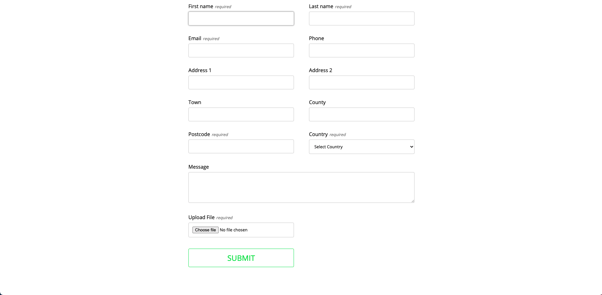

<!-- PROJECT LOGO -->

  <h3 align="center">ContactForm</h3>
  
  

    Simple contact form built with HTML, CSS, JavaScript, PHP
     
     
    <a href="https://kwanchan.co/form/" target='#'>Visit Site</a>
    ·
    <a href="https://github.com/zcestkc/ContactForm/issues">Report Bug</a>
    ·
    <a href="https://github.com/zcestkc/ContactForm/issues">Request Feature</a>
  

<!-- TABLE OF CONTENTS -->

## Table of Contents

1. [About the Project](#about-the-project)
2. [Built With](#built-with)
3. [Features](#features)
4. [Future Work](#future-work)
5. [Contact](#contact)

### About The Project

This is a form application built with HTML & CSS and JavaScript for the front and PHP for serving the form and then process the form submission and to email the contents of the form back to the user that fills it in. It is written in plain vanilla script without using any frameworks or libraries. <b>Note: it might take very long to receive the email due to the server speed of my hosting website, speed might differ depending which hosting website you use.</b>

### Built With

- HTML/CSS/JS
- PHP

### Features

- Form validation both in browser and on the server
- Attachment allowed: .pdf, .png, .jpg, .jpeg, .pdf, .doc, .docx
- App is responsive to all screen sizes

### Future work

- Create user login to their reddit account
- Allow user to comment on posts

### Contact

Kwan Chan - [@kwanchan95](https://twitter.com/kwanchan95)
